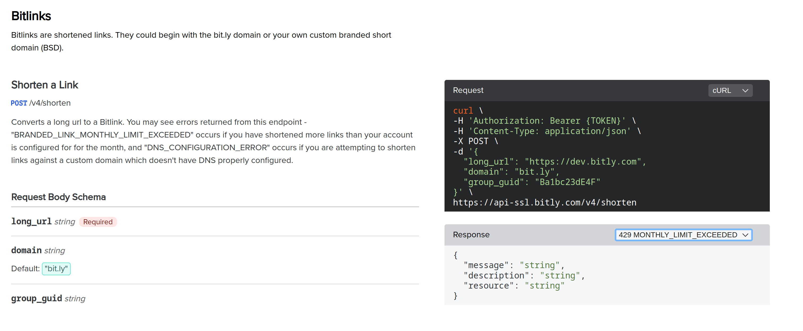

# Documentation
- You can add a small description of the problem you are trying to solve
- It would be nice to add some description on how to run the app locally, apart
  from install the modules 😀
- I don't this this text is necessay _Most open source projects use the MIT
  license. Feel free to choose whichever license you prefer._ under the license
  section
- This is a small one: `Node JS v20` -> `Nodejs v20 or later`
- The Screenshots aren't displaying, it looks the the URL is not fetching the
  image
- Checkout this template, [Readme Template](https://gist.github.com/martensonbj/6bf2ec2ed55f5be723415ea73c4557c4)

# App.jsx
- It is highly discouraged to perform direct DOM manipulation in ReactJs i.e. `new
  ClipboardJS(".btn");` The '.btn' is treated a selector by the ClipboardJS
  lib. This [lib](https://github.com/nkbt/react-copy-to-clipboard) can help clean this up
- Question: Why are you using Localstorage here? I think you can work without
> If you want a cleaner way of persisting state, checkout this [lib](https://github.com/rt2zz/redux-persist)
- Rate limits documentation
  - 
- We can modularize our app into 2 components i.e.
  - form
  - card
- Let's use the form elemement `<form></form>` instead for the `div` element,
  this will make the app more accessible
